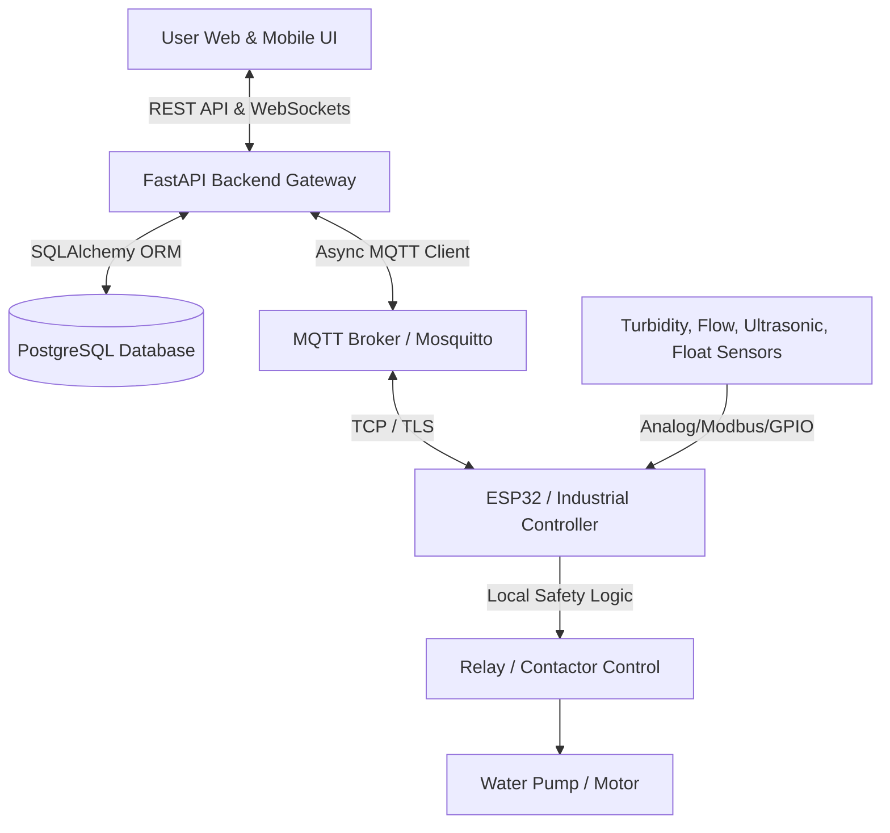

# HydraControl — Commercial IoT Smart Water Motor Control Platform

HydraControl is a robust, commercial-grade IoT platform for remote monitoring, automated protection, and control of water motors/pumps.

Designed to serve both simple **Home Users** (one-touch pump control, tank levels, turbidity alerts) and **Enterprise Customers** (multi-tenant hierarchical management: Organization → Site → Station → Controller → Motors/Sensors).

---

## 🏗️ Architecture Overview



### Core Design Principles
1. **Cloud controls, local controller protects:** Remote commands originate from cloud/UI, but critical safety cutoffs (high turbidity, dry run, overflow) execute locally on the ESP32 even if the internet is disconnected.
2. **Command state vs. Actual state:** Every command has a traceable `command_id` (`PENDING` → `SENT` → `ACK` → `EXECUTED`). Physical motor status is tracked independently via device telemetry.
3. **Auditable & Multi-tenant:** Every action is logged with user attribution and site-level authorization.

---

## 🚀 Directory Structure

```
hydra-control/
├── backend/
│   ├── app/
│   │   ├── api/v1/          # REST API route handlers
│   │   ├── core/            # Config, security, RBAC
│   │   ├── db/              # SQLAlchemy session, base models, seeds
│   │   ├── models/          # Database domain models
│   │   ├── schemas/         # Pydantic validation schemas
│   │   ├── services/        # Business logic services
│   │   ├── mqtt/            # MQTT client, topic router, handlers
│   │   ├── websocket/       # WebSocket hub & real-time streamer
│   │   ├── automation/      # Automation rules engine
│   │   └── main.py          # FastAPI entry point
│   ├── alembic/             # Database migrations
│   ├── tests/               # Pytest test suite
│   └── requirements.txt
├── frontend/                # React / TypeScript / Vite / Tailwind UI
├── firmware/                # ESP32 C++/Arduino firmware
├── device_simulator/        # Python ESP32 IoT hardware simulator
├── infra/
│   ├── docker/              # Dockerfiles & compose configs
│   └── mqtt/                # Mosquitto broker configuration
├── docs/                    # Architecture, API & hardware documentation
├── scripts/                 # Utility scripts & test harnesses
├── docker-compose.yml       # Multi-container orchestration
├── PROJECT_STATUS.md        # Single source of truth for progress
├── IMPLEMENTATION_PLAN.md   # Task roadmap & acceptance criteria
└── DECISIONS.md             # Architectural decision records
```

---

## ⚡ Quickstart

### Prerequisites
- Python 3.11+
- Node.js 18+
- Docker & Docker Compose (Optional for full containerized stack)

### 1. Backend Setup
```bash
cd backend
python -m venv venv
# On Windows:
.\venv\Scripts\activate
# On Linux/macOS:
# source venv/bin/activate

pip install -r requirements.txt
uvicorn app.main:app --reload --port 8000
# Alternatively, from the root project directory:
# uvicorn app.main:app --reload --port 8000 --app-dir backend
```

### 2. Run ESP32 Simulator
```bash
python device_simulator/esp32_simulator.py
```

### 3. Frontend Setup
```bash
cd frontend
npm install
npm run dev
```

---

## 📊 Health Probes
- `GET /health` — Overall application health
- `GET /health/db` — PostgreSQL database connectivity
- `GET /health/mqtt` — MQTT broker connectivity
